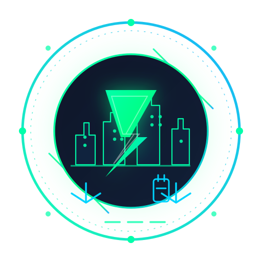
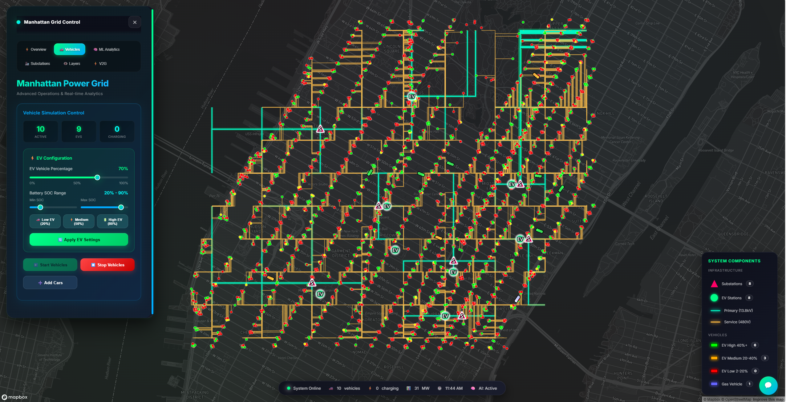
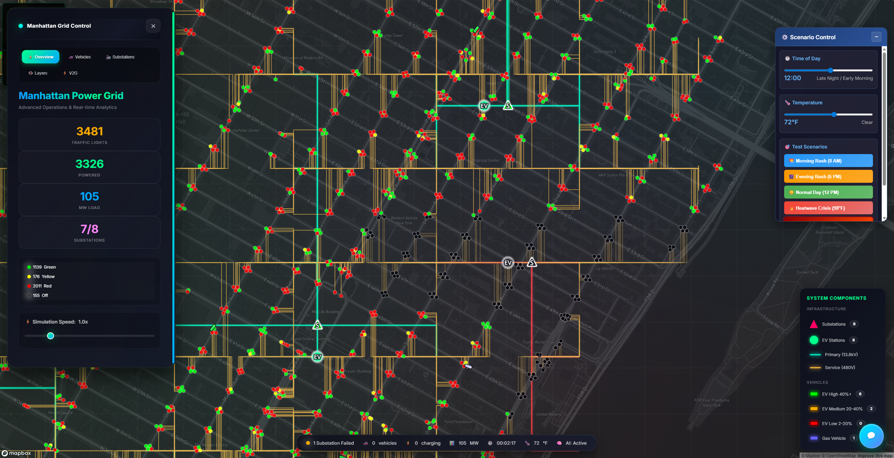
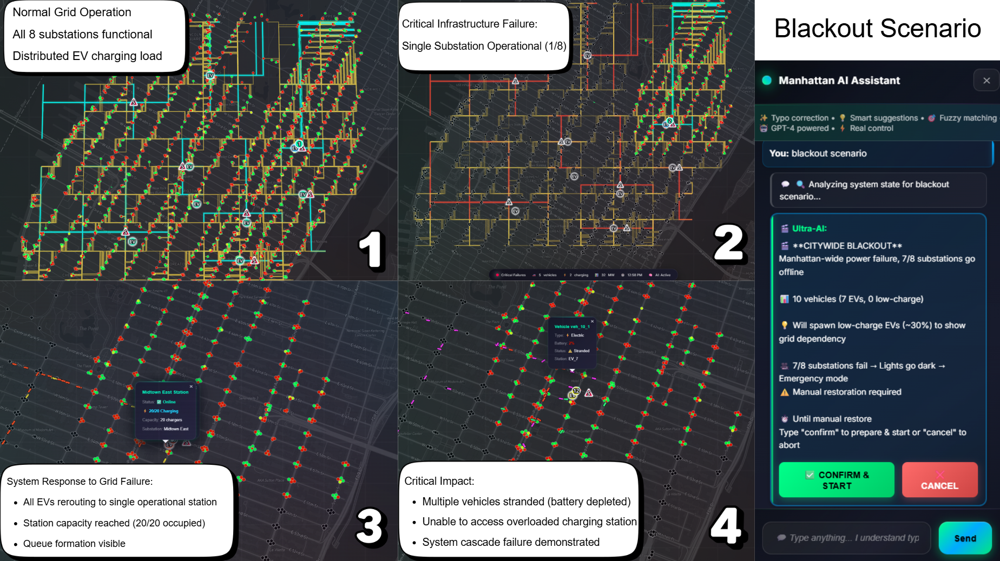
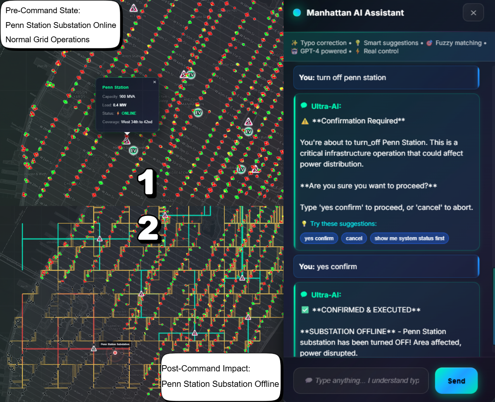
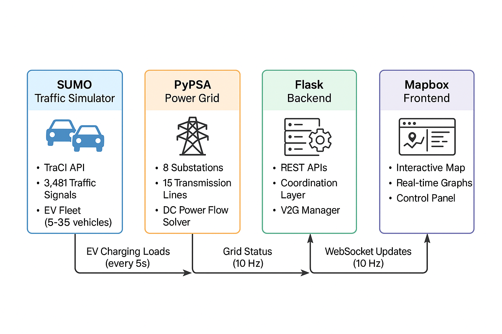

# ⚡ Volta

### The city, in sync.

*Real-time power-traffic co-simulation with vehicle-to-grid energy trading.*

<p align="center">
  
</p>

[](LICENSE)
[](https://python.org)
[](https://pypsa.org)
[](https://eclipse.dev/sumo/)
[](https://flask.palletsprojects.com/)
[](https://www2026.thewebconf.org/)
[](http://makeapullrequest.com)
[](https://github.com/XGraph-Team/SumoXPypsa)

---

## 🎯 The Pitch

**Volta is a digital twin of a city's power grid and traffic system working together — where electric vehicles keep the lights on when substations fail.**

Every EV on the road is also a battery on wheels. Volta connects a full-scale electrical grid simulation (PyPSA) to a real traffic microsimulation (SUMO), then lets those vehicles trade energy back into the grid when it matters most. The result is a real-time, city-scale co-simulation platform for vehicle-to-grid energy trading, emergency response, and grid-aware traffic management — built on Manhattan's real grid and street network.

## 🎬 Demo

Watch the full system in action — live power flow analysis, EV fleet movement, V2G emergency dispatch, and AI-assisted grid management:

[](https://www.youtube.com/watch?v=36mGJWjrSxw)

### Live Operations Dashboard



### Product Screenshots

| | |
|:---|:---|
|  |  |
| **Grid Overview** — Real-time power flow across all 8 substations with live load and stability telemetry. | **V2G Emergency Response** — EVs dispatch stored energy back to the grid the moment a substation crosses its emergency threshold. |
|  |  |
| **EV Fleet Simulation** — Thousands of electric vehicles route through the city, reporting SOC and charging behavior in real time. | **Substation Detail** — 13.8kV / 480V distribution view with per-substation status, loading, and control. |
|  | |
| **AI Analytics** — Machine-learning insights and conversational grid analysis, on demand. | |

---

## ❓ The Problem

Today's cities face a converging energy-and-mobility challenge:

| Challenge | Reality |
|---|---|
| **Grid fragility** | Aging distribution infrastructure, with substations and feeders pushed to their limits. |
| **EV adoption is outpacing the grid** | More cars charging means more peak demand — often at exactly the wrong time of day. |
| **Renewables need flexible storage** | Solar and wind are intermittent; the grid needs dispatchable capacity to stay stable. |
| **Blackouts cost billions** | Every major outage carries billions in economic damage and public-safety risk. |
| **V2G is proven in theory — rarely simulated at city scale** | Vehicles-as-batteries works on paper, but almost no one can model it on a real city grid. |
| **Operators lack real-time co-simulation tools** | Grid planners and traffic engineers work in separate silos, with separate maps and separate models. |

Volta is built to close that gap.

## 💡 The Solution

**Volta simulates a full city grid and its traffic in real time, treating every EV as a mobile battery that can send power back when the grid is stressed.**

When a substation begins to overload, Volta's V2G manager automatically identifies nearby electric vehicles with sufficient state of charge, prices the energy dynamically, and dispatches power back into the grid — all within seconds. Operators watch it happen on a single live map, and can intervene with one click.

## 🏗️ How It Works / Architecture

```
┌──────────────────────────────────────────────────────────────────┐
│                     Web Frontend                                 │
│   Mapbox visualization • Real-time controls • Live dashboards     │
└───────────────────────────────┬──────────────────────────────────┘
                                │  REST + WebSocket
┌───────────────────────────────▼──────────────────────────────────┐
│                      Flask Backend                               │
│   REST API • WebSocket broadcast • Data processing • Orchestration│
└───────────────┬───────────────────────────────┬──────────────────┘
                │                               │
┌───────────────▼──────────┐   ┌────────────────▼──────────────────┐
│      SUMO Simulator      │   │          PyPSA Grid               │
│  Vehicles • Routing      │   │  Power flow • Load • Stability    │
│  Traffic microsimulation │   │  8 substations • 13.8kV/480V      │
└───────────────┬──────────┘   └────────────────┬──────────────────┘
                │                               │
                └───────────────┬───────────────┘
                                │
                ┌───────────────▼───────────────┐
                │         V2G Manager           │
                │  Energy trading • Dynamic      │
                │  pricing • Emergency dispatch  │
                └────────────────────────────────┘
```

The loop is continuous: the **SUMO traffic simulation** moves vehicles through the city and tracks each EV's battery state → that state feeds the **PyPSA grid model**, where real power-flow equations determine load on every substation → the **V2G manager** prices and dispatches energy when a substation crosses its emergency threshold → results stream to the **Flask backend** and are pushed over WebSocket to the **frontend**, where operators see the whole city in sync.

## ✨ Key Features

**Power Grid** ⚡
- **PyPSA power-flow engine** — real-time DC power flow analysis and grid stability monitoring.
- **8-substation Manhattan grid** — realistic urban power infrastructure with 13.8kV primary and 480V secondary distribution.
- **Dynamic load balancing** — load management and optimization across the distribution network.

**Vehicle Simulation** 🚗
- **Eclipse SUMO integration** — full traffic microsimulation with realistic routing.
- **Configurable EV fleet** — EV penetration from 0–100%, with SOC-aware routing and charging.
- **Live vehicle telemetry** — position and battery state for every vehicle, updated in real time.

**Vehicle-to-Grid** 🔋
- **Bidirectional energy flow** — EVs push energy back to the grid on demand.
- **Automatic emergency dispatch** — V2G activates the moment a substation exceeds its 90% loading threshold.
- **Dynamic market pricing** — transparent $0.15/kWh energy trading with revenue optimization for EV owners.

**Web Interface** 🎮
- **Glassmorphic, real-time UI** — a premium, responsive operations center for desktop and mobile.
- **Mapbox live map** — full city visualization with satellite and street layers.
- **Interactive substation controls** — fail, restore, and enable V2G per substation with one click.

## 🧱 Tech Stack

| Layer | Technology | Purpose |
|---|---|---|
| Backend | **Flask** | REST API, WebSocket, data processing |
| Simulation | **SUMO** (Eclipse) | Traffic microsimulation, vehicle routing |
| Simulation | **PyPSA** | Power-flow analysis, grid load, stability |
| Maps | **Mapbox** | Real-time city visualization |
| Realtime | **WebSocket** | Live push updates to the frontend |
| Language | **Python 3.8+** | Core runtime |
| Testing | **pytest** | Unit, integration, and E2E test suites |
| Deployment | **Docker / Kubernetes** | Horizontally scalable containerized deployment |

## 🔩 System Components

### ⚡ PyPSA Grid
The electrical backbone of Volta. An 8-substation model of Manhattan's distribution network — 13.8kV primary feeders stepping down to 480V secondary systems — running real DC power-flow analysis. The grid engine continuously balances load, detects overload conditions, and evaluates stability in real time so operators always know the state of every bus, line, and substation.

### 🚗 SUMO Traffic
The street-level twin. Eclipse SUMO microsimulates the city's traffic with realistic vehicle dynamics, routing, and congestion. Every EV in SUMO carries a battery model — state of charge, charging behavior, and V2G discharge capability — so what happens in traffic directly shapes what's possible on the grid.

### 🔋 V2G Manager
The coordination layer between vehicles and the grid. It decides when EVs discharge, at what price, and to which substation. During emergencies, when a substation passes its **90% loading threshold**, the V2G manager auto-activates and dispatches high-SOC vehicles at up to **250kW per vehicle** — fast enough to keep critical loads online.

### 🤖 AI Analytics
A conversational analytics layer over the live simulation. Operators can query grid performance in plain language, surface anomalies, and get machine-learning-backed demand and stability insights — all inside the operations console.

## 📡 API Reference

All endpoints are served by the Flask backend at `/api/*` and stream live state over WebSocket.

| Endpoint | Method | Description |
|---|---|---|
| `/api/status` | `GET` | Complete system status — vehicles, grid state, performance metrics. |
| `/api/network_state` | `GET` | Detailed network topology with real-time component states. |
| `/api/sumo/start` | `POST` | Start the traffic simulation with vehicle count, EV %, and battery parameters. |
| `/api/fail/{substation}` | `POST` | Simulate a substation failure. |
| `/api/restore/{substation}` | `POST` | Restore a failed substation. |
| `/api/v2g/enable/{substation}` | `POST` | Enable V2G dispatch for a substation. |
| `/api/v2g/status` | `GET` | V2G system status and active dispatch sessions. |
| `/api/ai/chat` | `POST` | Ask the AI analytics layer about grid performance. |

**Start the simulation:**
```http
POST /api/sumo/start
Content-Type: application/json

{
  "vehicle_count": 1000,
  "ev_percentage": 0.7,
  "battery_min_soc": 0.2,
  "battery_max_soc": 0.9
}
```

**Enable V2G on a stressed substation:**
```http
POST /api/v2g/enable/Times%20Square
```


## 📊 Performance Metrics

Measured against the reference Manhattan deployment:

| Metric | Value |
|---|---|
| Concurrent vehicles | Up to **1000** simulated simultaneously |
| Update cadence | **100 ms** real-time grid resolution |
| V2G emergency response | **< 2 s** from threshold breach to dispatch |
| API latency | **< 50 ms** average response time |
| Scalability | Horizontally scalable via **Docker / Kubernetes** |

## 🌍 Use Cases

- **Utility operator training** — practice grid-failure response on a realistic city model before it happens in the real world.
- **V2G pilot design** — size a real vehicle-to-grid pilot by simulating pricing, participation, and emergency dispatch today.
- **City resilience planning** — test how a city's mobility and energy systems behave under stress, and where redundancy pays for itself.
- **EV fleet strategy** — quantify the revenue and grid value of a connected fleet that can both charge and discharge.
- **Academic research** — a reproducible, open platform for power-traffic co-simulation research (peer-reviewed at WWW '26).

## 🚀 Getting Started

Volta ships as a self-hosted platform. To run your own instance:

### Prerequisites

- **Python 3.8+**
- **8GB RAM minimum (16GB recommended)**
- **2GB free disk space**
- **OS**: Windows 10+, macOS 10.14+, Linux (Ubuntu 20.04+)
- **SUMO Traffic Simulator 1.15+**

### Install

```bash
git clone https://github.com/XGraph-Team/SumoXPypsa.git
cd SumoXPypsa

python -m venv venv
source venv/bin/activate   # Windows: venv\Scripts\activate

pip install -r requirements.txt
```

**SUMO installation:**

| OS | Command / Steps |
|---|---|
| **Windows** | [Eclipse SUMO Downloads](https://eclipse.dev/sumo/) → install → add to PATH |
| **macOS** | `brew install sumo` |
| **Linux (Ubuntu/Debian)** | `sudo add-apt-repository ppa:sumo/stable && sudo apt-get update && sudo apt-get install sumo sumo-tools sumo-doc` |

### Configure

```bash
cat > .env << EOF
# Server Configuration
FLASK_PORT=5000
FLASK_ENV=development
FLASK_DEBUG=True

# SUMO Configuration
SUMO_HOME=/usr/share/sumo  # Update with your SUMO installation path

# Mapbox Configuration (optional - for enhanced map features)
MAPBOX_API_TOKEN=your_mapbox_token_here

# Grid Configuration
DEFAULT_EV_PERCENTAGE=0.7
DEFAULT_VEHICLE_COUNT=10
BATTERY_MIN_SOC=0.2
BATTERY_MAX_SOC=0.9

# V2G Configuration
V2G_MARKET_PRICE=0.15
V2G_POWER_RATE=250
EMERGENCY_THRESHOLD=0.9
EOF
```

> The Mapbox token is **optional** — Volta runs on OpenStreetMap by default and upgrades to Mapbox satellite/styling when a token is provided.

### Run

```bash
# Linux/Mac
export SUMO_HOME=/usr/share/sumo

# Windows (PowerShell)
$env:SUMO_HOME = "C:\Program Files (x86)\Eclipse\Sumo"

python main_complete_integration.py
```

Then open your browser to `http://localhost:5000` and log into the operations center.

## 📂 Project Structure

```
Volta/
├── api/                            # API endpoints
├── core/
│   ├── power_system.py             # PyPSA power grid
│   └── sumo_manager.py             # SUMO integration
├── static/                         # Web assets (styles, scripts, logo)
├── data/                           # Grid + traffic data and configs
├── docs/
│   ├── screenshots/                # Product screenshots
│   └── *.md                        # Guides and documentation
├── tests/                          # Test suites
├── main_complete_integration.py    # Main application
├── integrated_backend.py           # Backend systems
├── v2g_manager.py                  # V2G functionality
├── index.html                      # Web interface
├── dashboard-preview.png           # Dashboard screenshot
├── requirements.txt
├── .env.example
└── README.md
```

## 🧪 Testing

```bash
# Unit tests
python -m pytest tests/unit/

# Integration tests
python -m pytest tests/integration/

# End-to-end tests
python -m pytest tests/e2e/

# All tests with coverage
python -m pytest --cov=. tests/
```

**Scenario walkthrough:**

1. Start vehicles → tune EV percentage and battery range → watch the fleet move and charge live.
2. Fail a substation → traffic lights drop to caution mode → EV charging stations reflect the outage.
3. Enable V2G on the affected substation → high-SOC EVs dispatch power back to the grid → loading recovers.

## 🗺️ Roadmap

### Shipped ✔️
- [x] Full power-grid simulation (PyPSA, 8 substations)
- [x] SUMO vehicle integration and EV fleet modeling
- [x] V2G energy trading with dynamic pricing and emergency dispatch
- [x] Glassmorphic real-time operations web interface

### On the horizon 🔭
- [x] AI-assisted grid analytics and conversational operator chat
- [ ] Real-time weather integration
- [ ] Advanced ML demand forecasting
- [ ] Multi-city deployment
- [ ] Mobile app companion
- [ ] Renewables (solar / wind) integration


## 📝 License

```
MIT License

Copyright (c) 2026 FlowThread

Permission is hereby granted, free of charge, to any person obtaining a copy
of this software and associated documentation files (the "Software"), to deal
in the Software without restriction, including without limitation the rights
to use, copy, modify, merge, publish, distribute, sublicense, and/or sell
copies of the Software, and to permit persons to whom the Software is
furnished to do so, subject to the following conditions:

The above copyright notice and this permission notice shall be included in all
copies or substantial portions of the Software.

THE SOFTWARE IS PROVIDED "AS IS", WITHOUT WARRANTY OF ANY KIND, EXPRESS OR
IMPLIED, INCLUDING BUT NOT LIMITED TO THE WARRANTIES OF MERCHANTABILITY,
FITNESS FOR A PARTICULAR PURPOSE AND NONINFRINGEMENT. IN NO EVENT SHALL THE
AUTHORS OR COPYRIGHT HOLDERS BE LIABLE FOR ANY CLAIM, DAMAGES OR OTHER
LIABILITY, WHETHER IN AN ACTION OF CONTRACT, TORT OR OTHERWISE, ARISING FROM,
OUT OF OR IN CONNECTION WITH THE SOFTWARE OR THE USE OR OTHER DEALINGS IN THE
SOFTWARE.
```

## 🙏 Acknowledgments

- **Eclipse SUMO** — Traffic simulation framework
- **PyPSA** — Power system analysis library
- **Mapbox** — Interactive mapping platform
- **Flask** — Web framework

---

## 👥 Team

Built by **FlowThread** for NextStep Hacks 2026.

- **Muhammad Mujtaba**

---

## 📅 Timeline

Built over **A Month** (September 2026) for NextStep Hacks 2026 in timeline. — Earth Forward.


<p align="center">
  Built for NextStep Hacks 2026 — Earth Forward 🌱
</p>
